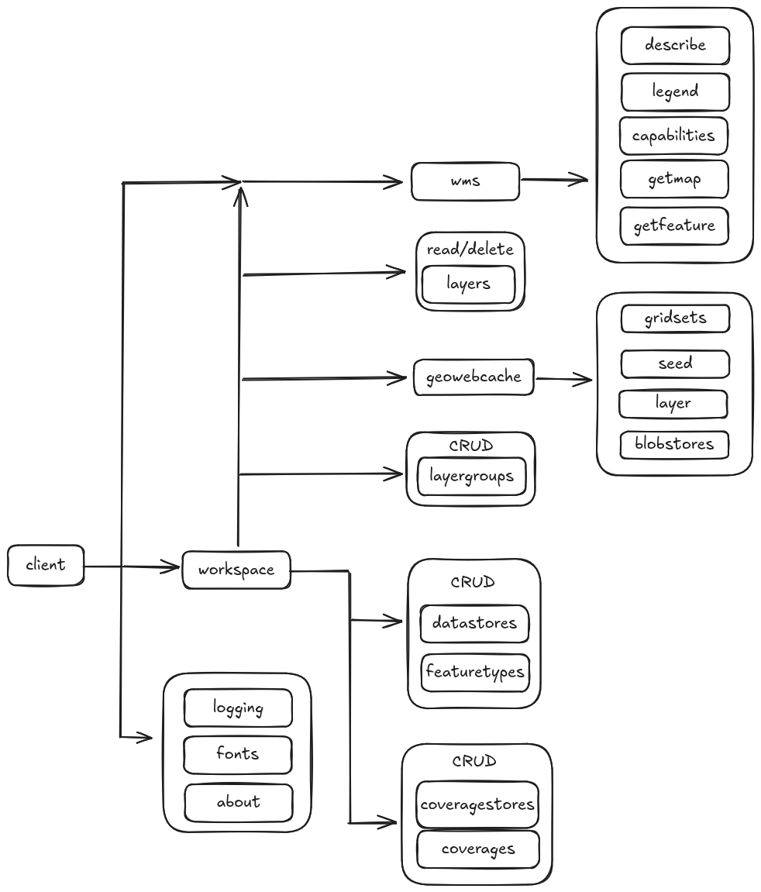

[](https://goreportcard.com/report/github.com/canghel3/go-geoserver)
[](https://codecov.io/gh/canghel3/go-geoserver)

# GeoServer Go Client

A GoLang library made to simplify interactions with [GeoServer](https://geoserver.org/), providing an idiomatic way to
talk to GeoServer’s REST API from your Go applications.

```bash
go get github.com/canghel3/go-geoserver
```

## Features

1. GeoServer

   **Management of:**

    - Workspaces
    - Vector Data Sources
    - Feature Types
    - Raster Data Sources
    - Coverages
    - Layer Groups

   **Services**:
    - WMS (GetMap only)


2. GeoWebCache
    - Seeding

## Examples

### GeoServer

| Resource              | Example                                                             |
|-----------------------|---------------------------------------------------------------------|
| Client Initialization | [`examples/client.go`](./pkg/client/client_test.go)                 |
| Workspaces            | [`examples/workspaces.go`](./pkg/actions/workspace_example_test.go) |
| DataStores            | [`examples/datastores.go`](./pkg/actions/datastore_example_test.go) |
| Feature Types         | [`examples/featuretypes.go`](./pkg/client/featuretype_test.go)      |
| CoverageStores        | [`examples/coveragestores.go`](./pkg/client/coveragestore_test.go)  |
| Coverages             | [`examples/coverages.go`](./pkg/client/coverage_test.go)            |

### GeoWebCache

| Resource       | Example                                                            |
|----------------|--------------------------------------------------------------------|
| Seeding        | [`examples/client.go`](./pkg/client/client_test.go)                |

## Available Data Sources

### Vector

| Format                  | Status |
|-------------------------|--------|
| CSV                     | ❌      |
| Directory of shapefiles | ✅      |
| GeoPackage              | ✅      |
| PostGIS                 | ✅      |
| Shapefile               | ✅      |
| WebFeatureService       | ✅      |

### Raster

| Format              | Status |
|---------------------|--------|
| AIG                 | ❌      |
| ArcGrid             | ❌      |
| DTED                | ❌      |
| EHdr                | ✅      |
| ENVIHdr             | ✅      |
| ERDASImg            | ✅      |
| GeoPackage (mosaic) | ❌      |
| GeoTIFF             | ✅      |
| ImageMosaic         | ❌      |
| ImagePyramid        | ❌      |
| NITF                | ✅      |
| RPFTOC              | ❌      |
| RST                 | ✅      |
| SRP                 | ❌      |
| VRT                 | ✅      |
| WorldImage          | ❌      |

## Work In Progress

- Caching
- Styles
- WMS, WFS, WCS, WMTS

## Tested GeoServer Versions

| Version | Status |
|---------|--------|
| 2.27    | ✅      |
| 2.22    | ✅      |

## Visual flow of components



